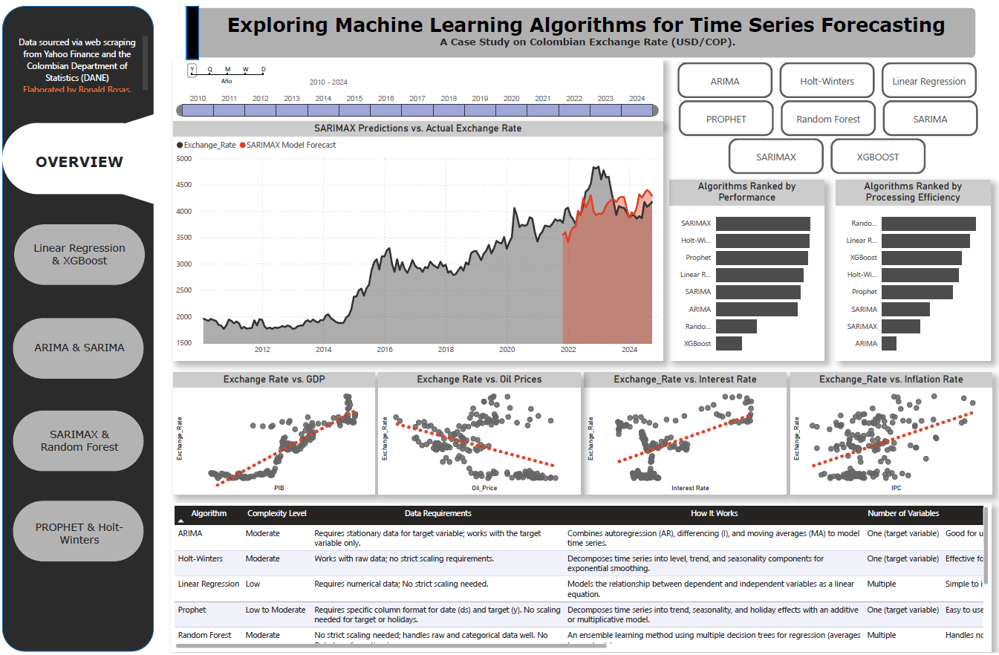
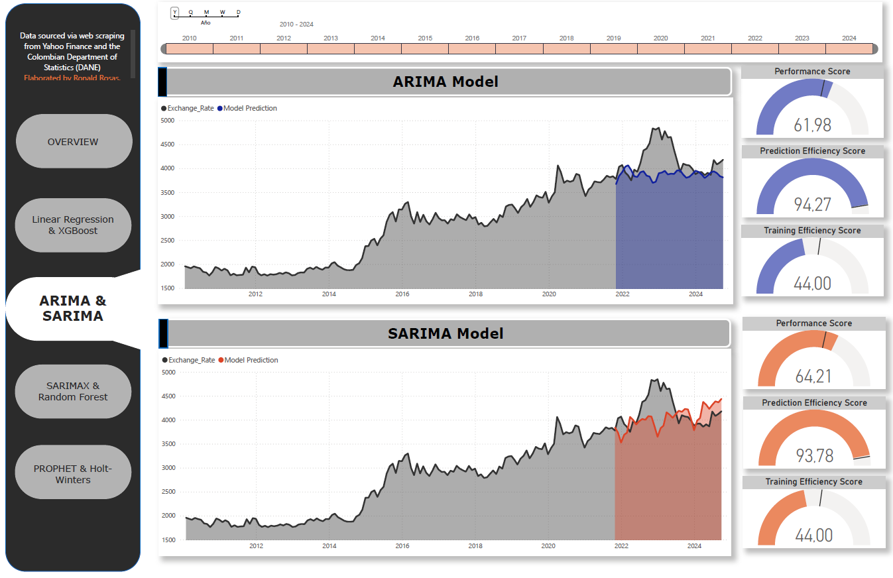

# Time_series_algorithms_Comparison
This project evaluates and compares various time series forecasting algorithms, including ARIMA, SARIMA, SARIMAX, Random Forest, XGBoost, and Linear Regression. The comparison is conducted using a dataset of monthly exchange rates and related economic indicators, emphasizing both prediction accuracy and computational efficiency. The analysis includes custom performance metrics and optimization scores to rank models based on their ability to balance accuracy, training time, and prediction speed. The project aims to provide insights into selecting the most suitable algorithm for time series forecasting tasks while demonstrating practical feature engineering, model evaluation, and visualization techniques.
---
## Dashboard Report

This project includes an interactive dashboard report created in Power BI, summarizing the key findings and insights visually.
### Full Dashboard
Explore the full interactive dashboard [here](https://app.powerbi.com/view?r=eyJrIjoiZTk3YTIxMjYtMmQxOC00M2Q2LWI1NmItODExYzBkMTZmZmE0IiwidCI6IjU3N2ZjMWQ4LTA5MjItNDU4ZS04N2JmLWVjNGY0NTVlYjYwMCIsImMiOjR9).

---
## Steps to Complete the Project

### 1. Install Required Packages and Libraries
#### 1.1 **Time Series Modeling**
- **`statsmodels`**: Used for classical time series models like ARIMA, SARIMAX, and Holt-Winters. Provides powerful statistical tools for analyzing and forecasting time series data.
  - `ARIMA`, `SARIMAX`: Models for univariate and multivariate time series with trend and seasonal components.
  - `ExponentialSmoothing`: Implements Holt-Winters smoothing for trend and seasonality.

- **`prophet`**: A robust library designed for forecasting time series data, handling seasonality, holidays, and missing values with ease.

#### 1.2. **Machine Learning**
- **`scikit-learn`**: Provides tools for data preprocessing, feature scaling, and machine learning algorithms:
  - `RandomForestRegressor`: An ensemble method for regression tasks, robust to outliers and non-linear patterns.
  - `LinearRegression`: A simple and interpretable algorithm for modeling linear relationships.
  - `Metrics`: Functions like `mean_squared_error`, `mean_absolute_error`, and `r2_score` for evaluating model performance.
  - `Preprocessing`: Tools like `MinMaxScaler` and `StandardScaler` for normalizing and scaling data.

- **`xgboost`**: A gradient boosting framework used for building powerful and efficient regression models. The `XGBRegressor` was implemented for its ability to handle non-linear relationships and large datasets efficiently.

#### 1.3. **Web Scraping**
- **`yfinance`**: Simplifies the process of downloading historical market data (e.g., Exchange Rate, Oil Prices, S&P 500 Index) directly from Yahoo Finance.
- **`requests`** and **`BeautifulSoup`**: Used to scrape interest rate data from `datosmacro.com`, enabling integration of external macroeconomic factors into the analysis.

#### 1.4. **Data Manipulation and Analysis**
- **`pandas`**: The backbone of data manipulation, allowing easy handling of time series data, merging datasets, and cleaning raw data.
- **`numpy`**: Essential for numerical computations, array manipulations, and mathematical operations.

#### 1.5. **Visualization**
- **`matplotlib`**: The foundational library for creating static, animated, and interactive visualizations.
- **`seaborn`**: Built on `matplotlib`, used for producing visually appealing statistical graphics and enhancing data understanding.

#### 1.6. **Performance Monitoring**
- **`time`**: Used for monitoring the execution time of models and processes, crucial for evaluating computational efficiency.

---

### 2. Data Collection and Preprocessing

#### 2.1 Scraping Data from Yahoo Finance
- Extracted time series for:
  - **Exchange Rate**
  - **Coffee Prices**
  - **Oil Prices**
  - **S&P 500 Index**

#### 2.2 Scraping Interest Rate Data from DatosMacro.com
- Retrieved historical interest rate data for enhanced model feature sets.

#### 2.3 Uploading GDP and Inflation Data
- Imported GDP and Inflation Rate data from an Excel file provided by the **Colombian Statistics Department (DANE)**.

---

### 3. Exploratory Data Analysis (EDA)
- Conducted an in-depth EDA to uncover patterns and trends in the data, including:
  - Correlation analysis between variables.
  - Seasonality, trends, and noise identification in time series data.
  - Visualization of historical data for feature selection.

---

### 4. Model Development
- Fitted the following models to the preprocessed data:
  - **Classical Time Series Models**:
    - ARIMA
    - SARIMA
    - SARIMAX
    - Holt-Winters
  - **Machine Learning Models**:
    - Random Forest
    - XGBoost
    - Linear Regression
  - **Additive Models**:
    - Prophet
- Evaluated models using custom metrics to assess:
  - Forecasting accuracy.
  - Computational efficiency.
  - Suitability for different types of time series data.

---

## Model Insights and Comparison

| Algorithm         | How It Works                                                                                 | Data Requirements                                                  | Complexity Level   | Number of Variables | Strengths                                                                 | Weaknesses                                                                            |
|-------------------|---------------------------------------------------------------------------------------------|--------------------------------------------------------------------|--------------------|----------------------|-----------------------------------------------------------------------------|--------------------------------------------------------------------------------------|
| **Linear Regression** | Models the relationship between dependent and independent variables as a linear equation. | Requires numerical data; No strict scaling needed.                 | Low                | Multiple             | Simple to implement and interpret; effective for linear trends.                      | Poor performance for non-linear or seasonal data.                                    |
| **Random Forest** | An ensemble learning method using multiple decision trees for regression (averages tree outputs). | No strict scaling needed; handles raw and categorical data well. No data transformation is necessary. | Moderate           | Multiple             | Handles non-linear relationships; robust to outliers; reduces overfitting.           | Not well optimized for identifying trends and seasonality over time.                 |
| **XGBoost**       | Gradient boosting framework optimizing regression trees iteratively to minimize error.       | No strict scaling required; works well with numerical and categorical data. | Moderate to High   | Multiple             | Handles non-linear relationships; robust to outliers; reduces overfitting.           | Not well optimized for identifying trends and seasonality over time.                 |
| **ARIMA**         | Combines autoregression (AR), differencing (I), and moving averages (MA) to model time series. | Requires stationary data for target variable; works with the target variable only. | Moderate           | One (target variable) | Good for univariate time series; effective for capturing trends.                     | Requires manual tuning of (p, d, q); performs poorly with sudden changes.            |
| **SARIMA**        | Extends ARIMA by adding seasonal components (P, D, Q, m) to model periodic patterns.         | Requires stationary data for target variable; works with the target variable only. | Moderate to High   | One (target variable) | Captures seasonality; flexible for various seasonal time series patterns.            | Requires manual tuning of (p, d, q) and (P, D, Q, m) parameters.                    |
| **SARIMAX**       | Extends SARIMA by incorporating exogenous variables (independent predictors) into the model. | Requires stationary data for target variable; scaling of exogenous variables recommended. | High               | Multiple             | Captures seasonality and external effects; flexible and robust for multivariate time series. | Requires manual tuning of (p, d, q) and (P, D, Q, m) parameters.                    |
| **Holt-Winters**  | Decomposes time series into level, trend, and seasonality components for exponential smoothing. | Works with raw data; no strict scaling requirements.               | Moderate           | One (target variable) | Effective for seasonal data; easy to implement and interpret.                        | Limited to simpler time series; requires manual parameter tuning.                    |
| **Prophet**       | Decomposes time series into trend, seasonality, and holiday effects with an additive or multiplicative model. | Requires specific column format for date (`ds`) and target (`y`). No scaling needed for target or holidays. | Low to Moderate    | One (target variable) | Easy to use with automated parameter tuning; handles missing data and holiday effects well. | Limited customization for complex dependencies; may overfit for short datasets.      |

---

## Key Findings and Insights
- The comparative performance of models varies based on data properties, such as stationarity and seasonality.
- Machine learning models (e.g., Random Forest and XGBoost) performed poorly even after adding a time index column to help them identify historical patterns.
- Classical models like SARIMAX provided reliable results for strongly seasonal data.
- Prophet demonstrated robust handling of seasonality with user-friendly implementation.

---

## Contact
For questions or feedback, feel free to reach out:
- 📧 Email: ronaldfc93@gmail.com
- [LinkedIn](https://www.linkedin.com/in/ronald-rosas-fonseca-b39323187/)
